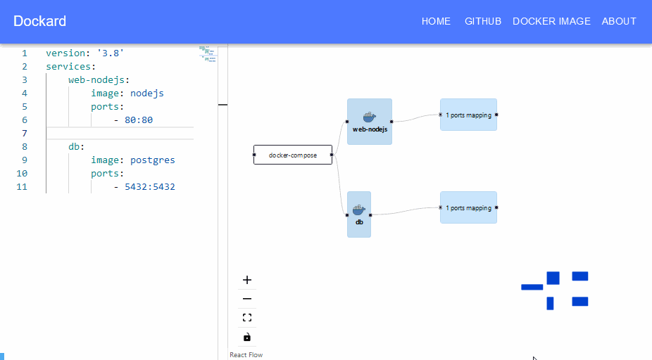

# Dockard
Dockard (**Dock**er C**ard**) is a web application that converts docker-compose YAML files into interactive diagram.



---
## 🎮 Demo
You can try Dockard on [dockard.vercel.app](https://dockard.vercel.app/).

---
## ⚡ Installation
The installation of Dockard is quite straightforward. Two methods exist:

### 🌿 From source
1. Clone the git repo
```bash
git clone https://github.com/alaabenfatma/dockard.git
```
2. Run via npm (based on react-scripts)
```bash
npm start
```


### 🐋 From a docker image
```bash
docker run -p 80:80 alaabenfatma/dockard
```

---
## 🧪 Tests
As of now, only a few basic unit tests have been implemented.
To run tests, use the following command:
```bash
npm run test
```

## Acknowledgements/Credits
- Vercel for hosting
- icons8 for icons